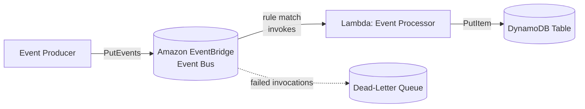

# Event-Driven Processing System

A simple event-driven system built with AWS CDK. Events are published to an
Amazon EventBridge bus, which triggers a Lambda function that stores each
event in a DynamoDB table.



## Components

- **EventBridge Bus** — receives events from producers.
- **EventBridge Rule** — matches events and invokes the Lambda.
- **Lambda: Event Processor** — writes each incoming event to DynamoDB.
- **DynamoDB Table** — stores processed events.
- **Dead-Letter Queue** — captures events the Lambda fails to process.

## Project Structure

```
infra/    CDK app (TypeScript) — defines the EventBridge bus, rule,
          DynamoDB table, DLQ, and Lambda function
lambda/   Event processor (Go) — writes each EventBridge event to DynamoDB
```

## Deploy

```sh
cd infra
npm install
npx cdk deploy
```

## Test

Send a test event to the bus (replace the bus/table names with the deployed
stack outputs):

```sh
aws events put-events --entries '[{
  "Source": "test",
  "DetailType": "TestEvent",
  "Detail": "{\"foo\":\"bar\"}",
  "EventBusName": "event-pipeline-bus"
}]'

aws dynamodb scan --table-name <table-name>
```

## Destroy

```sh
cd infra
npx cdk destroy
```

This removes every resource the stack created: the EventBridge bus/rule, the
Lambda function and its IAM role, the DynamoDB table, the dead-letter queue,
and the Lambda's CloudWatch log group.

Not removed (shared across all CDK apps in this AWS account/region, managed
outside this stack): the CDK bootstrap resources from `cdk bootstrap` (S3
asset bucket, ECR repo, IAM roles) and the asset objects already uploaded to
that bucket by past deploys.
